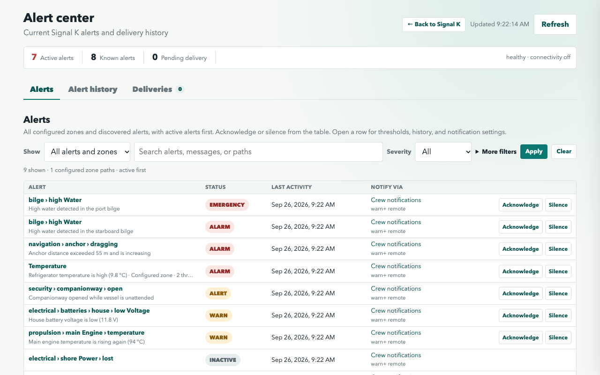
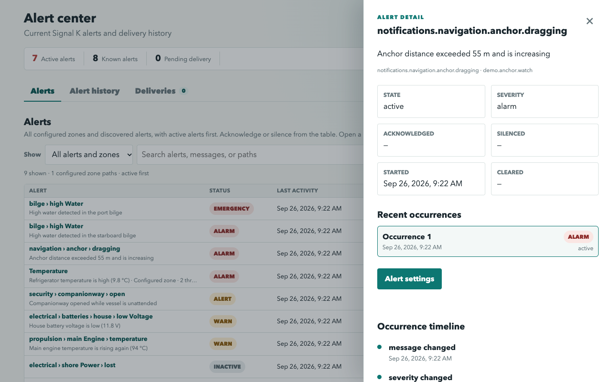
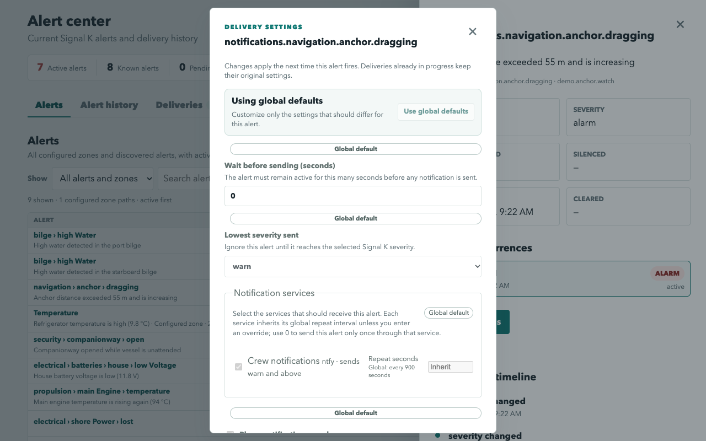
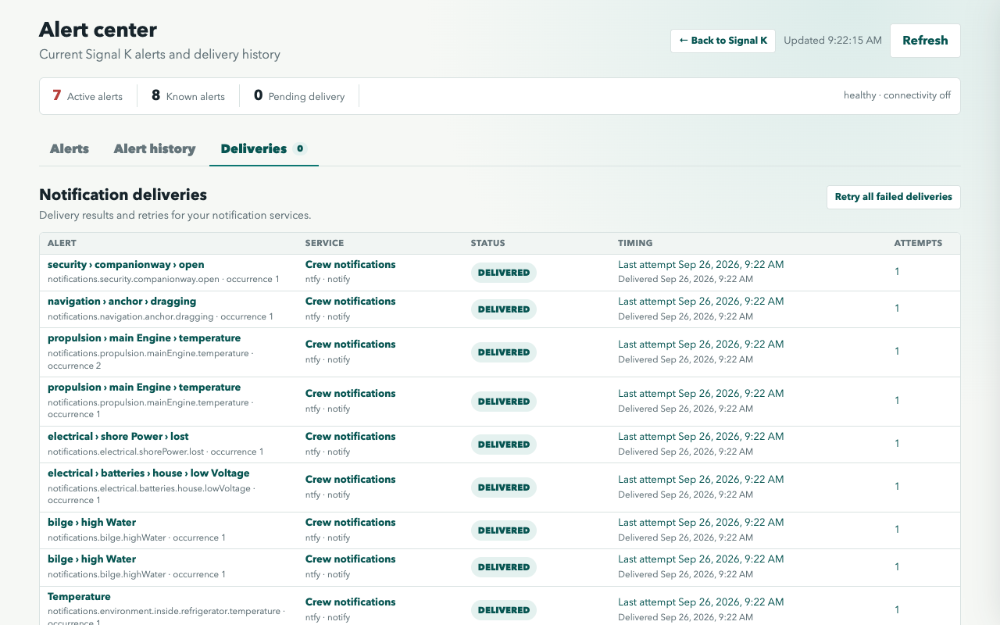
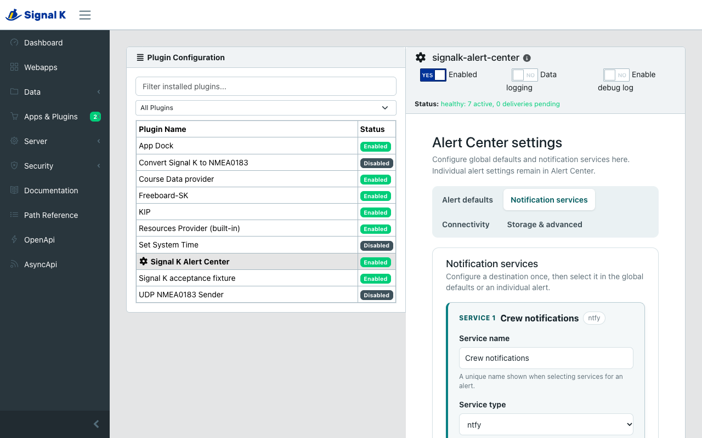
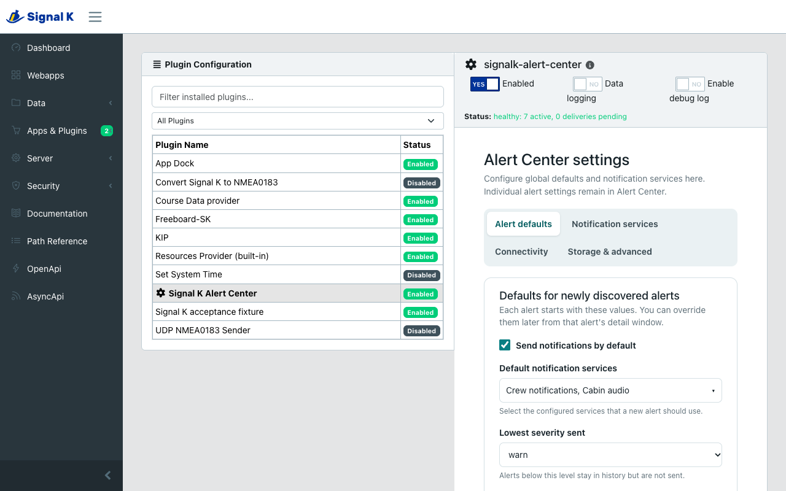

# Signal K Alert Center

Signal K Alert Center gives your boat one durable place for alarms and
notifications. It keeps alert history across restarts, shows configured Signal K
zones before they fire, and reliably forwards alerts even when the boat is
temporarily offline.



## Why use it?

Signal K normally exposes the current notification state. Alert Center adds the
operational history and delivery tracking needed when alerts matter after the
current value changes:

- **See what needs attention now.** Active alerts appear first in one compact
  list alongside inactive discovered alerts and defined zones.
- **Keep the full story.** Raises, meaningful updates, clears,
  acknowledgements, silences, and delivery results remain available after a
  restart.
- **Configure each alert.** Choose its notification services, minimum severity,
  activation delay, connectivity behavior, and per-service repeat interval.
- **Deliver through unreliable connectivity.** Outbound work is stored before
  sending. Each service retries independently, so one failure does not resend a
  notification that another service already accepted.
- **Use the services that fit your boat.** Alert Center supports ntfy,
  PagerDuty, Discord, Telegram, and optional Signal K Wyoming sounds and spoken
  announcements.
- **Understand every delivery.** The delivery view shows the destination,
  status, timing, retry attempts, and error details.

## Alert Center

Open **Webapps → Signal K Alert Center** after enabling the plugin.

The main table combines all known alert definitions:

- Signal K paths that have been observed under `notifications.*`;
- paths defined by Signal K `meta.zones`, even before they fire;
- the current state and severity, with active alerts first.

Select an alert to see its latest occurrence, the five most recent occurrences,
and its event history. **Acknowledge** and **Silence** use Signal K's notification
API when the source supports those operations. They do not erase history or
pretend the underlying condition has cleared.



### Per-alert settings

Select an alert, then choose **Alert settings**. Settings are inherited from the
global defaults until you override them for that alert. Changes apply to future
occurrences.

You can configure:

- whether external notification delivery is enabled;
- the lowest severity that should be sent;
- how long the condition must remain active before sending;
- which configured notification services receive it;
- a repeat interval for each selected service;
- what to do when internet connectivity is unavailable;
- Wyoming notification sound and spoken-text behavior.



### Alert and delivery history

**Alert history** is a chronological record of Signal K alert changes. It is
separate from **Deliveries**, which tracks attempts to send those alerts to
notification services.



## Supported notification services

Notification services are created globally in **Server → Plugin Config → Signal
K Alert Center**. Individual alerts then select from those named services.

| Service                | What is sent                                    | Notes                                                                                                  |
| ---------------------- | ----------------------------------------------- | ------------------------------------------------------------------------------------------------------ |
| ntfy                   | Alert title, severity, message, and state       | Supports self-hosted or hosted ntfy servers.                                                           |
| PagerDuty              | Trigger, acknowledgement, and resolution events | Uses one stable deduplication key for an occurrence.                                                   |
| Discord                | Alert messages through a webhook                | Each configured webhook is an independent service.                                                     |
| Telegram               | Alert messages through a bot                    | Supports chats, forum topics, and silent Telegram delivery.                                            |
| Signal K Wyoming audio | Severity sound and optional spoken alert        | Optional; requires `signalk-wyoming`. Speech additionally needs a TTS service such as `signalk-piper`. |

Wyoming is not required to use Alert Center. When both sound and speech are
enabled, Alert Center queues the configured severity sound first and then the
spoken text. Uploaded Wyoming sound IDs can be selected for individual alerts.
Alert Center records announcement acceptance separately from the playback states
reported by Wyoming, including aggregate and per-satellite outcomes. A reported
`played` state confirms completion from the satellite process; it cannot prove
that the physical speaker was audible.



## Installation and first run

### From the Signal K App Store

1. Open the Signal K **App Store**.
2. Install **Signal K Alert Center**.
3. Open **Server → Plugin Config → Signal K Alert Center**.
4. Enable the plugin and add any notification services you want to use.
5. Set the defaults that newly discovered alerts should inherit and save.
6. Open **Webapps → Signal K Alert Center** to review alerts and adjust individual
   alert settings.

The default database is stored in the plugin's Signal K data directory. You do
not need to enter an absolute path. Existing supported database layouts are
migrated in place on startup.

### Install without publishing to npm

Download or clone this repository on the Signal K host, build it, and install the
resulting package archive into the Signal K data directory:

```sh
npm ci
npm run build
npm pack
cd ~/.signalk
npm install /path/to/signalk-alert-center-0.1.0.tgz
```

Restart Signal K after installation. Docker installations should run the final
`npm install` command inside the Signal K container or bake the archive into a
derived image so the installation survives container replacement.

## Global settings

The Signal K plugin configuration contains settings shared by all alerts:

- notification-service connection details and secrets;
- defaults inherited by newly discovered alerts;
- optional internet-connection control;
- retention and delivery limits;
- the database reset action.



Alert-specific routing and timing belong in the Alert Center webapp, not in the
global plugin configuration.

The **Reset database** button permanently removes stored alert definitions,
history, deliveries, and per-alert settings. Global plugin configuration is kept.

## Connectivity control

Alert Center can optionally turn on a Signal K PUT-capable connectivity switch,
such as a Starlink power control, when eligible work is waiting. It only turns a
connection off when it can prove that it turned that session on. Leave this
feature disabled if another system manages connectivity.

The default connectivity check uses Google's lightweight `generate_204`
endpoint. You can replace it with another URL that returns any successful 2xx
response.

## Privacy and network access

Alert Center adds no analytics or telemetry.

Alert definitions, history, policies, and delivery attempts are stored locally in
the Signal K data directory. Data leaves Signal K only when you configure and
select a notification service for an alert:

- ntfy receives the destination topic plus alert text and severity;
- PagerDuty receives incident event data and the configured integration key;
- Discord receives alert text at the configured webhook URL;
- Telegram receives alert text, chat identifiers, and the configured bot token;
- `signalk-wyoming` receives a sound ID and/or rendered speech text through its
  in-process Signal K API. Wyoming then sends audio to the selected satellites.

Connection credentials are used only for their configured service. Avoid placing
secrets in alert names or messages, because alert content may be sent to every
service selected for that alert.

## Operational notes

- Alert Center subscribes to `notifications.*` and reconciles the current Signal K
  notification tree at startup.
- A `normal`, `nominal`, cleared, or null notification transition clears the
  current occurrence but does not delete its history.
- Delivery is persisted before network activity begins. Pending work is recovered
  after a Signal K or plugin restart.
- Retention cleanup is disabled by default and never removes active occurrences or
  pending delivery work.
- Use the diagnostics section at the bottom of the webapp when troubleshooting.
  It shows database health, queue depth, scheduler state, connectivity state, and
  per-service results.

## Help and support

- [Report a problem or request a feature](https://github.com/arodus/signalk-alert-center/issues)
- [View the source code](https://github.com/arodus/signalk-alert-center)
- [Read the changelog](./CHANGELOG.md)
- [Developer and local-testing guide](./DEVELOPERS.md)

When reporting a problem, include the Alert Center version, Signal K version,
relevant plugin logs, and the diagnostics shown in the webapp. Remove notification
service secrets and personal vessel information first.

## License

[MIT](./LICENSE)
